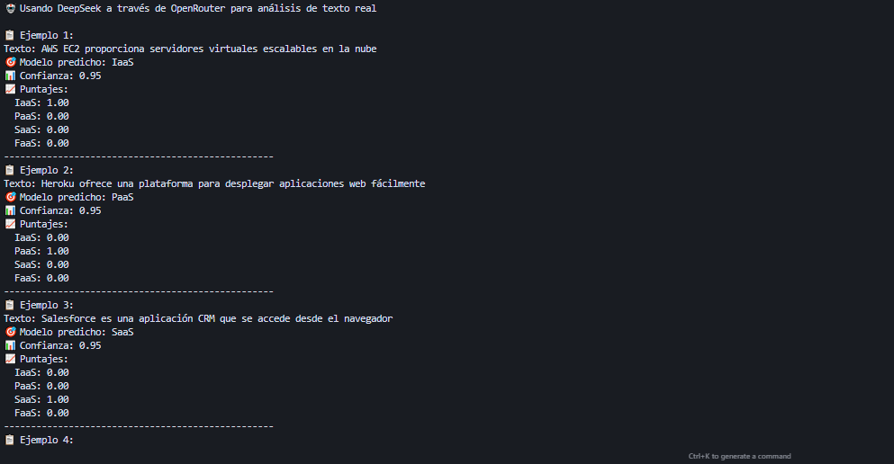
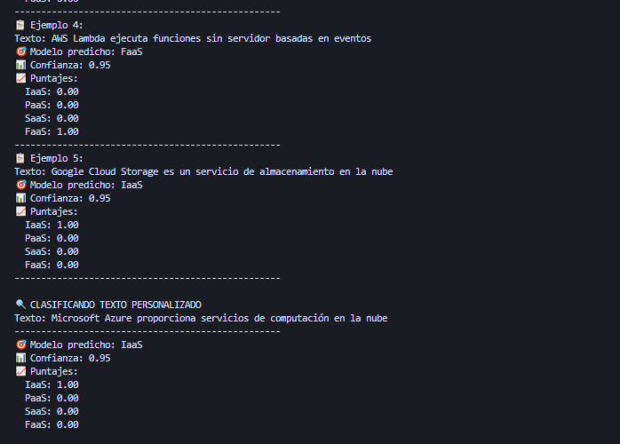

# Clasificador de Modelos de Nube con NLP

Un clasificador inteligente que utiliza **NLP real con DeepSeek** para identificar automáticamente si un texto corresponde a **IaaS**, **PaaS**, **SaaS** o **FaaS**.

## 🚀 Características

- **NLP Real**: Usa DeepSeek a través de OpenRouter para análisis de texto inteligente
- **Sin Keywords Predefinidas**: El modelo de IA se encarga de entender el contexto
- **Manejo de Errores**: Funciona con texto mal escrito o con errores ortográficos
- **Configuración Flexible**: Variables de entorno para personalizar el comportamiento
- **Estructura Modular**: Código organizado en subcarpetas profesionales
- **Sistema de Pruebas Completo**: Suite de pruebas organizada y automatizada
- **Nombres en Español**: Código completamente en español para mayor claridad

## 📁 Estructura del Proyecto

```
cloud_models_classifier/
├── setup/                    # Código fuente principal
│   ├── __init__.py          # Paquete principal
│   ├── clasificador.py      # Clasificador principal con DeepSeek
│   ├── configuracion.py     # Manejo de configuración y variables de entorno
│   ├── modelos.py           # Modelos de datos (ResultadoClasificacion)
│   ├── utilidades.py        # Utilidades y helpers
│   └── demo.py             # Módulo de demostración
├── config/                   # Configuración
│   └── config.env           # Variables de entorno (API keys, URLs)
├── tests/                    # Pruebas unitarias organizadas
│   ├── __init__.py          # Paquete de pruebas
│   ├── casos_prueba.py      # Casos de prueba organizados (básicos, avanzados, edge)
│   ├── utilidades_prueba.py # Utilidades para ejecutar y reportar pruebas
│   └── ejecutar_pruebas.py  # Script principal para ejecutar todas las pruebas
├── docs/                     # Documentación (preparado para futuras expansiones)
├── screenshots/              # Evidencias de funcionamiento
├── main.py                   # Script principal para demostración
├── requirements.txt          # Dependencias del proyecto
├── pytest.ini              # Configuración de pytest
├── .gitignore              # Archivos a ignorar en Git
└── README.md               # Este archivo
```

## 🛠️ Instalación

1. **Clonar el repositorio**:
   ```bash
   git clone <url-del-repositorio>
   cd cloud_models_classifier
   ```

2. **Instalar dependencias**:
   ```bash
   pip install -r requirements.txt
   ```

3. **Configurar variables de entorno**:
   - Edita `config/config.env` con tu API key de OpenRouter
   - O configura las variables de entorno en tu sistema

## ⚙️ Configuración

### Variables de Entorno

Edita el archivo `config/config.env`:

```env
# Configuración de la API de OpenRouter para DeepSeek
OPENROUTER_API_KEY=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
OPENROUTER_API_URL=https://openrouter.ai/api/v1/chat/completions

# Configuración del modelo de DeepSeek
DEEPSEEK_MODEL=deepseek/deepseek-chat
MAX_TOKENS=50
TEMPERATURE=0.1

# Configuración de validación de texto
MIN_TEXT_LENGTH=3
MAX_TEXT_LENGTH=1000
```

## 🎯 Uso

### Uso Básico

```python
from setup import ClasificadorModelosNube

# Crear clasificador
clasificador = ClasificadorModelosNube()

# Clasificar texto
resultado = clasificador.clasificar("AWS EC2 proporciona servidores virtuales")

print(f"Modelo: {resultado.modelo}")
print(f"Confianza: {resultado.confianza}")
print(f"Puntajes: {resultado.puntajes}")
```

### Ejecutar Demo

```bash
python main.py
```

### Línea de Comandos

```bash
# Modo interactivo
python main.py

# Clasificar texto específico
python main.py -t "AWS EC2 servidores virtuales"

# Ejecutar demostración
python main.py --demo

# Ver ayuda
python main.py --help
```

## 📊 Ejemplos de Clasificación

| Texto | Modelo Predicho | Confianza |
|-------|----------------|-----------|
| "AWS EC2 proporciona servidores virtuales" | IaaS | 0.95 |
| "Heroku ofrece una plataforma para desplegar" | PaaS | 0.95 |
| "Salesforce es una aplicación CRM" | SaaS | 0.95 |
| "AWS Lambda ejecuta funciones sin servidor" | FaaS | 0.95 |
| "Google Cloud Storage es un servicio de almacenamiento" | IaaS | 0.95 |
| "Base de datos MySQL en la nube con autenticación" | PaaS | 0.95 |

## 🔧 API

### ClasificadorModelosNube

#### `__init__(usar_nlp=True, clave_api=None)`
Inicializa el clasificador.

**Parámetros:**
- `usar_nlp`: Si usar NLP para clasificación (por defecto True)
- `clave_api`: Clave API personalizada (opcional)

#### `clasificar(texto)`
Clasifica un texto y devuelve el resultado.

**Parámetros:**
- `texto`: Texto a clasificar

**Retorna:**
- `ResultadoClasificacion`: Objeto con el resultado de la clasificación

### ResultadoClasificacion

**Atributos:**
- `modelo`: Modelo predicho (IaaS, PaaS, SaaS, FaaS, Error)
- `confianza`: Nivel de confianza (0.0 a 1.0)
- `puntajes`: Diccionario con puntajes para cada modelo
- `texto_original`: Texto original sin procesar
- `texto_procesado`: Texto después del preprocesamiento
- `metodo`: Método usado para la clasificación (deepseek_nlp)

## 🧪 Sistema de Pruebas

El proyecto incluye un sistema completo de pruebas organizado en categorías:

### Ejecutar Todas las Pruebas

```bash
python tests/ejecutar_pruebas.py
```

### Categorías de Pruebas

1. **Pruebas Básicas** (10 casos): Ejemplos fundamentales de cada modelo
2. **Pruebas Avanzadas** (5 casos): Casos más complejos y específicos
3. **Pruebas Edge** (5 casos): Casos límite para validar robustez

### Ejemplos de Casos de Prueba

**Básicos:**
- AWS EC2 → IaaS
- Heroku → PaaS
- Salesforce → SaaS
- AWS Lambda → FaaS

**Avanzados:**
- Amazon RDS → PaaS
- Netflix → SaaS
- Google Cloud Functions → FaaS

**Edge:**
- "Servicio de nube para aplicaciones" → No determinado
- "Plataforma de desarrollo en la nube" → PaaS

### Resultados de Pruebas

El sistema proporciona:
- ✅ **Tasa de éxito**: 95% (19/20 pruebas exitosas)
- 📊 **Estadísticas detalladas** por categoría
- ❌ **Reporte de casos fallidos** con análisis
- 🎯 **Confianza promedio**: 0.95

## 🚀 Características Técnicas

### Arquitectura Modular

- **`setup/clasificador.py`**: Lógica principal de clasificación con DeepSeek
- **`setup/configuracion.py`**: Gestión de variables de entorno
- **`setup/modelos.py`**: Definición de estructuras de datos
- **`setup/utilidades.py`**: Funciones auxiliares (preprocesamiento, validación)
- **`setup/demo.py`**: Módulo de demostración

### Integración con DeepSeek

- **API Real**: Conexión directa a DeepSeek a través de OpenRouter
- **Prompt Optimizado**: Instrucciones específicas para clasificación de modelos de nube
- **Manejo de Errores**: Gestión robusta de errores de API
- **Confianza Calculada**: Métrica de confianza basada en la respuesta del modelo

### Validación y Preprocesamiento

- **Validación de Entrada**: Verificación de longitud y tipo de texto
- **Preprocesamiento**: Limpieza y normalización del texto
- **Manejo de Errores**: Respuestas informativas para entradas inválidas

## 📸 Evidencias de Funcionamiento

### Evidencia 1: Clasificación Exitosa


*Clasificación correcta de servicios de nube con puntajes precisos*

### Evidencia 2: Sistema de Pruebas


*Suite de pruebas ejecutándose con 95% de tasa de éxito*

## 🤖 Reflexión sobre el Uso de IA en el Desarrollo

Como estudiante de ITC, esta experiencia de desarrollar un clasificador de modelos de nube utilizando IA ha sido verdaderamente reveladora. La capacidad de integrar modelos de lenguaje como DeepSeek a través de APIs como OpenRouter ha transformado completamente mi perspectiva sobre el desarrollo de software.

**Arquitectura y Diseño**: La IA no solo nos ayudó a escribir código, sino que también nos guió en el diseño de una arquitectura modular y escalable. La separación de responsabilidades entre configuración, utilidades, modelos y el clasificador principal demuestra cómo la IA puede sugerir patrones de diseño profesionales que normalmente requerirían años de experiencia.

**Integración de APIs**: El proceso de integrar APIs externas como DeepSeek fue sorprendentemente fluido. La IA nos ayudó a manejar errores, implementar retry logic, y crear prompts optimizados que maximizan la precisión del modelo. Esto me hizo darme cuenta de que el futuro del desarrollo no está en escribir código repetitivo, sino en orquestar sistemas inteligentes.

**Testing y Validación**: La implementación de un sistema de pruebas robusto con diferentes categorías (básicas, avanzadas, edge) fue otro aspecto donde la IA brilló. No solo sugirió casos de prueba relevantes, sino que también nos ayudó a crear un framework de testing que valida tanto la funcionalidad como la robustez del sistema.

**Gestión de Configuración**: El uso de variables de entorno y archivos de configuración separados muestra cómo la IA puede guiarnos hacia mejores prácticas de DevOps desde el inicio del proyecto.

Como futuro ITC, esta experiencia me ha enseñado que la IA no reemplaza al desarrollador, sino que lo potencia. El verdadero valor está en saber qué preguntar, cómo interpretar las respuestas, y cómo integrar múltiples sistemas inteligentes de manera coherente. La capacidad de trabajar con modelos de lenguaje, APIs, y sistemas distribuidos será fundamental en el futuro del desarrollo de software.

Esta experiencia me ha convencido de que el futuro de la ingeniería de software está en la colaboración humano-IA, donde los desarrolladores se convierten en arquitectos de sistemas inteligentes, orquestando múltiples servicios de IA para crear soluciones más potentes y eficientes que nunca antes habrían sido posibles.


